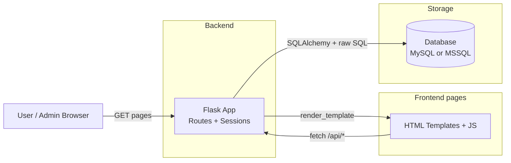
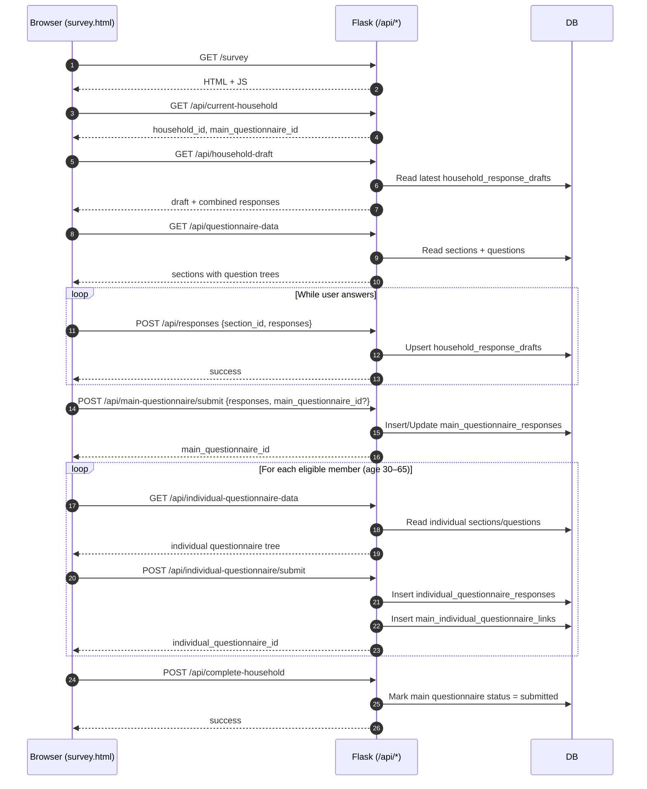
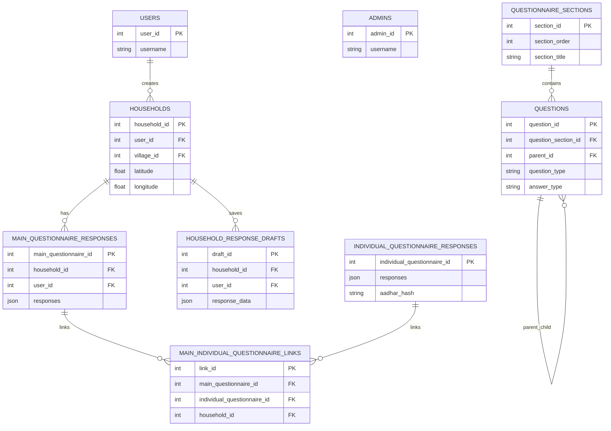

# Project Workflow (Longitudinal Survey Application)

This document explains **how the project works end-to-end** (UI → Flask routes → database) so a mentor can quickly understand the workflow.

The project is a **Flask + SQLAlchemy** survey system with:

- **Admin portal**: manage questionnaire sections/questions, manage locations, manage accounts, export data.
- **User portal**: create/resume a household, fill the main questionnaire, enter member details, optionally fill an individual questionnaire (age eligibility), and finally mark the household as completed.

---

## 1) What runs the app

There are two app entrypoints in this repo:

- `app.py` → **MS SQL Server** via ODBC (env vars like `MSSQLHOST`, `MSSQLUSER`, ...)

Both provide the same UI pages and nearly the same API surface.

---

## 2) High-level architecture



Key idea:

- Pages are server-rendered HTML (`templates/`) but most actions are done via **AJAX calls** from JS to `/api/*`.

---

## 3) Authentication + roles

The app uses **Flask sessions** (cookie-based) to store:

- `role` → `"user"` or `"admin"`
- `user_id`, `username`
- `household_id`, `main_questionnaire_id` (for the user’s active survey context)

Routes are protected via a role check (e.g. `@role_required("user")`, `@role_required("admin")`).

---

## 4) Core domain concepts (what the data represents)

### Locations (hierarchy)
Locations are stored as:

`states → districts → blocks → sub_centers → villages`

These drive both:

- Admin location management (create/edit/delete; bulk uploads)
- User household creation (household is tagged with a village and higher-level location IDs)

### Household
A household is the “survey unit”. Users create or resume a household. The session stores the active `household_id`.

### Main questionnaire
Admins define questionnaire **sections** and **questions**.

Users fill the main questionnaire section-by-section.

### Individual questionnaire
After the main questionnaire is submitted, the UI collects member details. Members with **age 30–65** are eligible for an individual questionnaire (as implemented in the UI).

### Drafts / resume
The system supports resuming work through two layers:

- **Local draft**: browser `localStorage` key `survey_draft_v1` (see `templates/survey.html`).
- **Server draft**: table `household_response_drafts` via `/api/responses` and `/api/survey-draft`.

---

## 5) User workflow (end-to-end)

### Pages involved

- Home: `/` → `templates/home.html`
- User login: `/user-login` → `templates/user_login.html`
- User dashboard: `/user-dashboard` → `templates/user_dashboard.html`
- Survey portal: `/survey` → `templates/survey.html`

### User journey (flowchart)

```mermaid
flowchart TD
  A[User Login] --> B[User Dashboard]
  B -->|Create / Resume| C[Household Selected
session.household_id]
  C --> D[Open /survey]

  D --> E[Fetch questionnaire
GET /api/questionnaire-data]
  E --> F[Answer questions
per section]
  F -->|Autosave| G[POST /api/responses
updates household_response_drafts]

  F -->|Submit main| H[POST /api/main-questionnaire/submit
updates main_questionnaire_responses]
  H --> I[Enter member count]
  I --> J[Capture member details
(Aadhaar validated)]
  J --> K{Member age 30-65?}
  K -->|No| L[Skip individual]
  K -->|Yes| M[Fill individual questionnaire]
  M --> N[POST /api/individual-questionnaire/submit
creates individual responses + link]
  N --> O{All eligible members done?}
  L --> O
  O -->|Yes| P[POST /api/complete-household
marks main as submitted]
  O -->|No| J
  P --> Q[Back to dashboard]
```

### User workflow (sequence diagram)

This is the most useful “mentor view” because it shows the exact request/response rhythm.



Notes:

- Aadhaar is handled carefully in the backend (hash for lookup, encryption at rest).
- The **server-side draft** is stored in `household_response_drafts.response_data` and can contain both `sections` and `survey_state`.
- Household GPS can be stored/updated via `POST /api/save-household-location` (updates `households.latitude/longitude`).

---

## 6) Admin workflow

### Pages involved

- Admin login: `/admin-login` → `templates/admin_login.html`
- Admin dashboard: `/admin-dashboard` → `templates/admin_dashboard.html`

### Admin journey (flowchart)

```mermaid
flowchart TD
  A[Admin Login] --> B[Admin Dashboard]

  B --> C[Manage Questionnaire]
  C --> C1[Sections: POST/PUT/DELETE /api/admin/section]
  C --> C2[Questions: POST/PUT/DELETE /api/admin/question]
  C --> C3[Question tree: GET /api/questions/tree/:section_id]

  B --> D[Manage Locations]
  D --> D1[CRUD: /api/admin/state, /district, /block, /sub-center, /village]
  D --> D2[Bulk upload: POST /api/admin/locations/bulk/:level]

  B --> E[Manage Accounts]
  E --> E1[Create/delete users: /api/admin/user, /api/admin/user/:id]
  E --> E2[Create/delete admins: /api/admin/admin, /api/admin/admin/:id]

  B --> F[Browse/Export Survey Data]
  F --> F1[Household lists + filters: /api/admin/households/*]
  F --> F2[Exports (wide format): /api/admin/households/export/*]
  F --> F3[Individual lookup by Aadhaar: /api/admin/individual-lookup]
```

---

## 7) Database workflow (schema + lifecycle)

### Schema creation

For the MySQL flavor, schema can be applied via:

- `scripts/init_db.py` → runs `scripts/survey_schema_full.sql`

The app code also contains “ensure tables exist” helpers for questionnaire-related tables.

### Key tables (conceptual)



---

## 8) “Workflow cheat sheet” (what to explain in 2 minutes)

1. Admin sets up **locations** + **questionnaire** (sections/questions).
2. User logs in, creates/selects a **household** and opens `/survey`.
3. Survey UI loads sections/questions via `/api/questionnaire-data` and autosaves via `/api/responses`.
4. Main submit stores JSON into `main_questionnaire_responses`.
5. User enters members; eligible members fill individual questionnaire → stored in `individual_questionnaire_responses` and linked.
6. When all eligible members are done, `/api/complete-household` marks the household survey as **submitted**.
7. Admin exports and looks up individuals (Aadhaar lookup uses hash + encrypted storage).

---

## 9) Where to look in code (anchors)

- Backend routes + DB logic:
  - `app.py` (MySQL)
  - `app1.py` (MSSQL)
- User survey UI (main + members + individual):
  - `templates/survey.html`
- Admin dashboard behavior:
  - `templates/admin_dashboard.html`
  - `static/js/admin.js`
  - `static/js/locations.js`
- DB schema scripts:
  - `scripts/survey_schema_full.sql`
  - `scripts/init_db.py`
